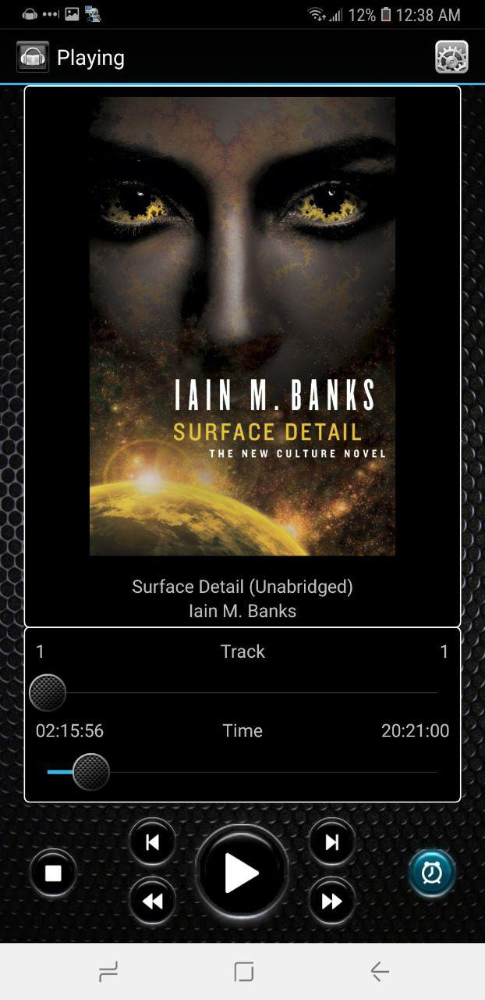

# earful Audiobook Player

I designed this audiobook player back when it was common to buy audiobooks
on CDs and it was even height of technology when they started to release MP3
CDs of audiobooks! This was way before audible came along and made everything so
nice and easy. I love audiobooks dearly, and I built this player to my needs. 
I still use it for those books that aren't on audible.

It was listed on Google Play for $1. It made a total of $25. Eventually I changed it be free 
and got a lot more users, and a much lower rating.

Here it is now released to the world with a MIT license, instead of just going to waste. Even though
Java isn't my day-to-day programming language maybe it will show I can code too ;).
I wish the Audible folks would take the sleep and shake feature because it really is awesome.

_NOTE: The Dropbox integration requires a key. The Earful key has been redacted in this release.
You can search for "REDACTED" to find where to put it once you apply for and get your own._

Here is some of the text from the Google Play store blurb. Remember, this isn't an Ad for the app,
this is free on the store and all the source is here to build it yourself. Including taking it and making your own version!

An audiobook player that will always keep your place in the book, 
as well as help you separate your music collection from your audiobooks. 
This app provides a beautiful interface that allows you to display audiobooks 
in folders of your choice. Your spot in the audiobook will always be saved so 
you will never lose your spot even between device reboots. 

Some Features:
* Sleep Mode - Shake the device every once and a while to keep the audiobook playing, otherwise the book will slowly mute and pause. Easy to turn on and off with the push of a button!.
* Position Saved - Books will always remember what position they are at so you can continue listening to it from the some spot in the future. No scrambling around to find where you were!
* Book Covers - Displays book covers. Just place the cover art in it's corresponding audiobook folder. No internet connection required.
* Dropbox Support - Now you can download books directly from your Dropbox account to your device!
* Book Library - The app will maintain a separate library of your audiobooks. No mixing up your music and audiobooks again!
* Help - Easy to dismiss tutorial overlays are shown to help new users find their way around the app!
* No Ads! - This is the full application, no ads and no internet connection required to drain your battery! 

# Build Instructions

* Download Android Studio <https://developer.android.com/studio/index.html>
* Install Android SDK version 15 or 16 using the SDK Manager 
* Get a application key from Dropbox <https://www.dropbox.com/developers/support> and replace the key called "REDACTED" in the source with your own, if you want the dropbox integration to work.
* Build and Install